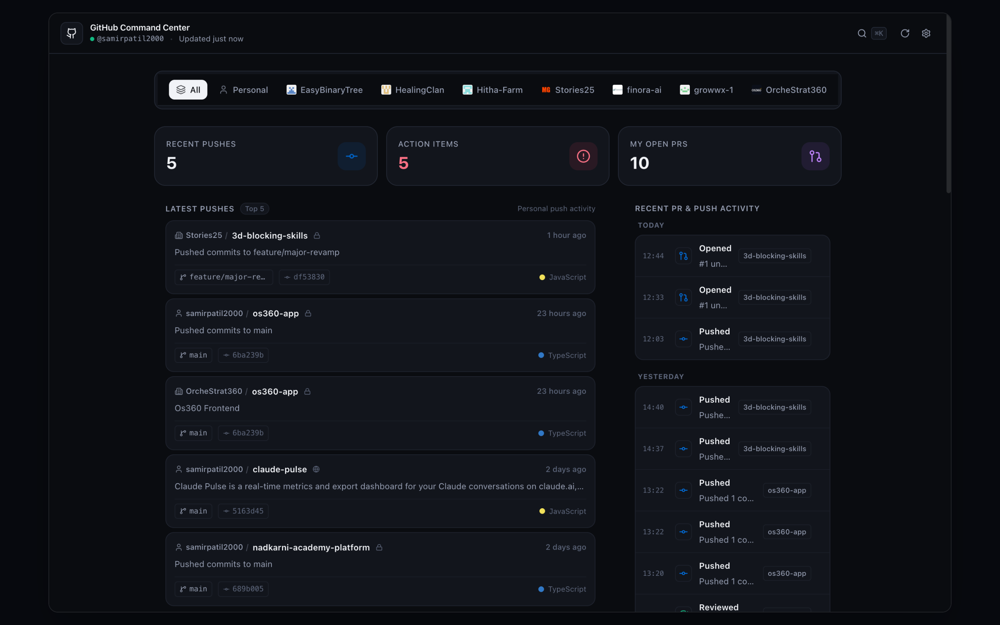
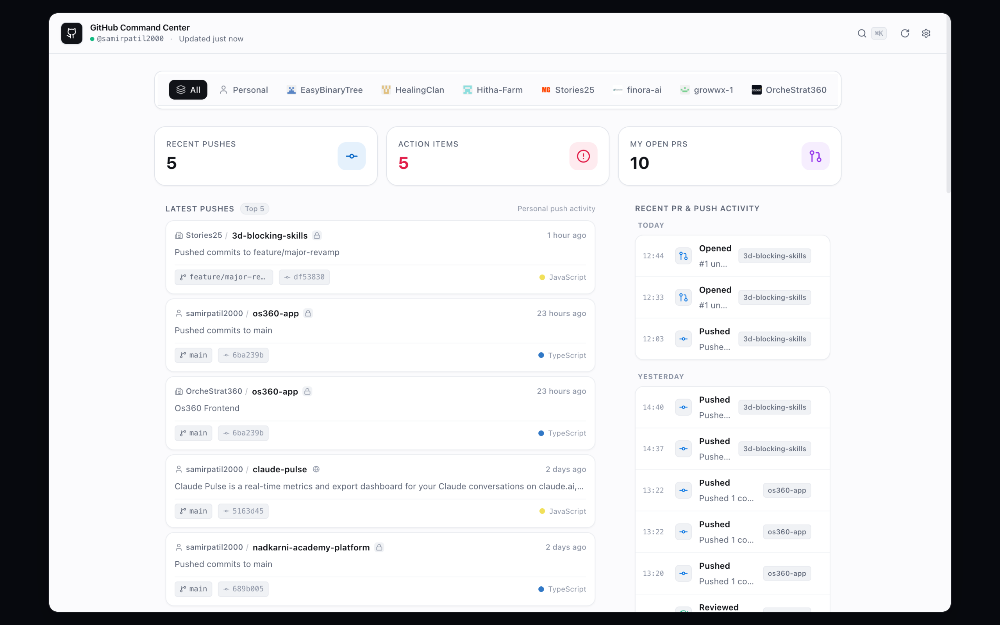

<p align="center">
  
</p>

<h1 align="center">GitOctant</h1>

<p align="center">
  <strong>A high-precision developer navigation instrument for GitHub</strong>
</p>

<p align="center">
  
  
  
  
  
</p>

---

### ✨ Why GitOctant?

GitOctant gives developers an instant, high-signal overview of everything happening across their personal GitHub repositories and multi-organization workspaces — with zero noise, zero latency, and zero telemetry.

- **🚀 Top 5 Personal Pushes** — Tracks and deduplicates the 5 most recent repositories you personally pushed code to, sorted strictly newest-first by your push timestamp.
- **⚠️ Attention Radar** — Instant triage for pull requests requiring action: review requests, changes requested, failing CI checks, and merge conflicts.
- **🌿 My Open Pull Requests** — Real-time overview of all PRs you authored across personal accounts and organizations with CI status, review progress, and branch chips.
- **⏱️ Personal Activity Timeline** — Chronological developer activity stream grouped by Today, Yesterday, and Earlier.
- **🏢 Multi-Organization Intelligence** — Automatically discovers and filters across all GitHub organizations you belong to with one-click filtering.
- **⌨️ Global Command Palette (`⌘K`)** — Lightning-fast fuzzy search across all your repositories, PRs, action items, and quick commands.
- **🌓 Dual Surface Cockpit** — Seamlessly switch between a compact 560px toolbar popup and an expanded full-screen New Tab Cockpit dashboard with Dark, Light, and System themes.
- **🔒 100% Private & Local** — Tokens are stored strictly on your local device in `chrome.storage.local`. Zero telemetry, no intermediary servers, direct GitHub API calls.
- **⚡ Instantaneous Performance** — SWR in-memory and disk caching with automatic background synchronization.

---

### 📸 Preview

<p align="center">
  
</p>

<p align="center">
  
</p>

---

### 📥 Installation

#### Chrome Web Store (Recommended)
> https://chromewebstore.google.com/detail/ddnajpnjpncdkldlcielnlkobgbolnha?authuser=0&hl=en

#### Manual Developer Installation (Chrome, Brave, Edge, Arc)
1. Clone this repository:
   ```bash
   git clone https://github.com/samirpatil2000/gitoctant.git
   cd gitoctant
   ```
2. Install dependencies and build the extension:
   ```bash
   npm install
   npm run build
   ```
3. Open your browser and navigate to `chrome://extensions`.
4. Toggle **Developer mode** in the top-right corner.
5. Click **Load unpacked** and select the `dist/` folder inside this directory.
6. Pin **GitOctant** to your browser toolbar.

---

### 🔒 Privacy & Security Model

- **100% Local Storage**: Your GitHub Personal Access Token is stored strictly on your local device in sandboxed `chrome.storage.local`.
- **Zero Telemetry**: No analytics, no tracking pixels, no logging servers, and no third-party scripts.
- **Direct GitHub API**: Communicates directly and exclusively with official GitHub endpoints (`https://api.github.com`).
- **Read-Only Scope**: Operates entirely with minimal read-only permissions — never writes to or modifies your code or repositories.

---

### 🔑 GitHub Personal Access Token (PAT) Setup

GitOctant works with both **Fine-grained Personal Access Tokens** and **Classic PATs**:

1. Go to **GitHub Settings** $\rightarrow$ **Developer Settings** $\rightarrow$ [**Personal Access Tokens**](https://github.com/settings/tokens?type=beta).
2. Click **Generate new token**.
3. Under **Repository access**, choose **All repositories** (or select specific repositories).
4. Recommended read-only permissions:
   - **Commit statuses**: Read-only
   - **Contents**: Read-only
   - **Metadata**: Read-only (mandatory)
   - **Pull requests**: Read-only
   - **Organization permissions $\rightarrow$ Members**: Read-only
5. Paste the token into GitOctant Settings and click **Test Connection**.

---

### ⌨️ Keyboard Shortcuts

| Shortcut | Action |
| :--- | :--- |
| `⌘K` or `Ctrl+K` | Open Global Command Palette & Search |
| `R` | Refresh GitHub Data |
| `,` (Comma) | Open Settings & Preferences |
| `1` – `5` | Open Top 1–5 Pushed Repositories directly |
| `Esc` | Close Modal / Command Palette |

---

### 🛠️ Development & Testing

```bash
# Start local development server with HMR
npm run dev

# Run Vitest automated unit tests
npm run test

# Run real-browser Puppeteer E2E validation
npm run test:e2e

# Build production bundle
npm run build
```

---

### 📁 Architecture

```text
gitoctant/
├── src/
│   ├── api/             # Resilient GitHub REST API client & endpoints
│   │   ├── client.ts    # Fetch client with rate limiting & error handling
│   │   ├── users.ts     # User profile & token validation
│   │   ├── repos.ts     # Repository details & commit lookups
│   │   ├── pulls.ts     # PR search, review states & CI checks
│   │   ├── events.ts    # User push events & activity feeds
│   │   └── organizations.ts # Discovered organizations
│   ├── lib/             # Core business logic & algorithms
│   │   ├── push-aggregator.ts # Top 5 personal pushes algorithm
│   │   ├── attention.ts # PR attention classification engine
│   │   ├── activity.ts  # Chronological activity timeline generator
│   │   ├── formatters.ts# Relative timestamps, SHAs, language colors
│   │   ├── storage.ts   # Type-safe chrome.storage.local wrapper
│   │   ├── theme.ts     # Light / Dark / System theme engine
│   │   └── mock-data.ts # High-fidelity demo data
│   ├── components/      # Apple-inspired UI component system
│   │   ├── Header.tsx
│   │   ├── LatestPushes.tsx
│   │   ├── AttentionSection.tsx
│   │   ├── PullRequestsSection.tsx
│   │   ├── ActivityTimeline.tsx
│   │   ├── RepoGrid.tsx
│   │   ├── CommandPalette.tsx
│   │   ├── SettingsModal.tsx
│   │   ├── OnboardingModal.tsx
│   │   └── OrgFilter.tsx
│   ├── popup/           # Extension popup surface (560px)
│   ├── newtab/          # Expanded New Tab Cockpit dashboard
│   ├── background/      # Service worker for background sync & badge alerts
│   └── styles/          # Tailwind design system & SF typography
├── public/              # Manifest V3 & PNG icons
├── test/                # Unit tests & browser automation E2E suites
└── scripts/             # Multi-target build and asset scripts
```

---

### 📄 License

[MIT](LICENSE) © [Samir Patil](https://github.com/samirpatil2000)
